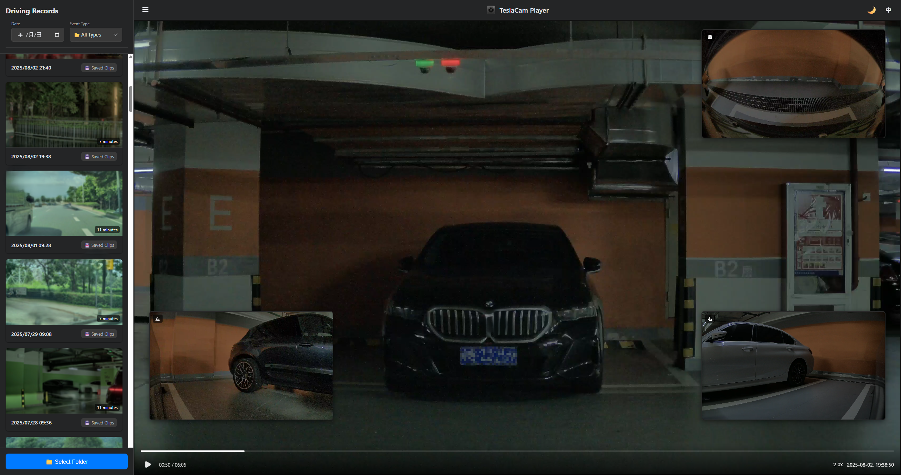

# TeslaCam Player

A modern, browser-based viewer for your TeslaCam footage. Play all four camera angles (Front, Back, Left, Right) simultaneously with a sleek and intuitive interface.



## ✨ Features

*   🎥 **Quad-Camera Sync Playback**: View footage from all four cameras at once, perfectly synchronized.
*   🎨 **Dual-Theme Interface**: Switch between a light and dark mode. Automatically detects your system's preference!
*   🌐 **Bilingual Support (EN/ZH)**: Interface in English or Chinese. Automatically detects your browser's language.
*   ⏩ **Playback Speed Control**: Watch footage at 0.5x, 1.0x, 1.5x, or 2.0x speed.
*   ↔️ **Collapsible Sidebar**: Maximize video space by hiding the event list.
*   🔍 **Intuitive Filtering**: Easily filter recordings by date and event type (Recent, Saved, Sentry).
*   🔄 **Interactive PiP**: Click on any Picture-in-Picture view to make it the main video.
*   🕰️ **Real-Time Clock**: See the actual date and time of the recording as you play.
*   ⌨️ **Keyboard Shortcuts**: Control playback with your keyboard (`Space` for play/pause).
*   🗺️ **Map Integration**: Click on the event's city to view the location on Gaode Map or Google Maps.
*   💾 **Clip Download**: Download the currently playing video clip directly from the player.
*   🔒 **100% Private**: All processing is done locally in your browser. Your files are never uploaded.
*   😊 **Emoji-Enhanced UI**: A touch of fun in the user interface.

## 🚀 How to Use

Because of web browser security policies, you need to run this application from a local web server.

**1. Start the Local Server**

If you have Node.js installed, the easiest way is to use `npx`:

```bash
npx http-server -p 8080 .
```

Then, open your browser and go to `http://localhost:8080`.

**2. Select Your TeslaCam Folder**

1.  Click the "📁 Select Folder" button.
2.  In the file selection dialog, navigate to and select the root `TeslaCam` folder from your USB drive.

**3. Browse and Play**

*   Your recordings will appear in the sidebar, sorted by date.
*   Use the filters to find specific events.
*   Click on any event to start playing.
*   Click on a city name (if available) to open the location on Gaode Map or Google Maps.
*   When paused, click the 💾 icon in the header to download the current video file.

## ⌨️ Keyboard Shortcuts

*   **`Spacebar`**: Play / Pause the video.

## 🔒 Privacy First

This tool is built with privacy as a top priority. **All file processing happens directly in your browser.** Your videos and data are never uploaded to any server. It's completely private and secure.

## 🛠️ Tech Stack

*   **HTML5, CSS3, JavaScript (ES6+)**
*   No frameworks, just pure vanilla JS for performance.
*   File System Access API for local file handling.

## 📄 License

MIT License

---

# TeslaCam 播放器

一个现代化的、基于浏览器的 TeslaCam 录像查看器。通过一个清爽直观的界面，同步播放所有四个摄像头（前、后、左、右）的画面。


## ✨ 功能特性

*   🎥 **四镜头同步播放**: 完美同步播放所有四个摄像头的画面。
*   🎨 **双主题界面**: 可在浅色和深色模式之间切换，并能自动匹配您的系统偏好。
*   🌐 **双语支持 (中/英)**: 提供中文和英文界面，并能自动检测您的浏览器语言。
*   ⏩ **播放速度控制**: 以 0.5x、1.0x、1.5x 或 2.0x 的速度观看录像。
*   ↔️ **可折叠侧边栏**: 隐藏事件列表，最大化视频观看空间。
*   🔍 **智能筛选**: 按日期和事件类型（最近、已保存、哨兵）轻松筛选录像。
*   🔄 **交互式画中画**: 点击任何画中画视图，即可将其切换为主视频。
*   🕰️ **实时时钟**: 播放时可看到录像对应的真实日期和时间。
*   ⌨️ **键盘快捷键**: 使用键盘控制播放（`空格键` 播放/暂停）。
*   🗺️ **地图集成**: 点击事件的城市名称，即可通过高德地图或谷歌地图查看具体位置。
*   💾 **片段下载**: 直接从播放器下载当前正在播放的视频片段。
*   🔒 **100% 私密**: 所有文件处理都在您的浏览器本地完成，绝不上传您的任何文件。
*   😊 **Emoji 增强界面**: 为用户界面增添一丝趣味。

## 🚀 使用方法

由于浏览器的安全策略，您需要通过本地 Web 服务器来运行此应用。

**1. 启动本地服务器**

如果您安装了 Node.js，最简单的方式是使用 `npx`：

```bash
npx http-server -p 8080 .
```

然后，打开浏览器并访问 `http://localhost:8080`。

**2. 选择您的 TeslaCam 文件夹**

1.  点击 “📁 选择文件夹” 按钮。
2.  在文件选择对话框中，找到并选择您 U 盘中的根 `TeslaCam` 文件夹。

**3. 浏览和播放**

*   您的录像将按日期在侧边栏中列出。
*   使用筛选器查找特定事件。
*   点击任何事件即可开始播放。
*   点击事件列表中的城市名称（如果存在），可以在高德地图或谷歌地图上打开该位置。
*   暂停时，点击标题栏的 💾 图标即可下载当前视频文件。

## ⌨️ 键盘快捷键

*   **`空格键`**: 播放 / 暂停视频。

## 🔒 隐私优先

本工具将隐私放在首位。**所有文件处理都直接在您的浏览器中进行。** 您的视频和数据永远不会被上传到任何服务器。完全私密、安全。

## 🛠️ 技术栈

*   **HTML5, CSS3, JavaScript (ES6+)**
*   无框架，为追求性能仅使用原生 JS。
*   使用文件系统访问 API 处理本地文件。

## 📄 许可证

MIT 许可证